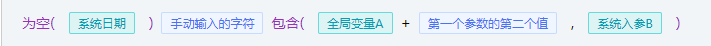

### 数据格式展示



```json
[
	{
		"type": "fx",
		"value": "isNull",
		"desc": "为空",
		"arguments": [
			[
				{
					"type": "var",
					"desc": "系统日期",
					"value": "system.currentUserId"
				}
			]
		]
	},
	{
		"desc": "string",
		"value": "手动输入的字符",
		"type": "constant"
	},
	{
		"type": "fx",
		"value": "contains",
		"desc": "包含",
		"arguments": [
			[
				{
					"type": "var",
					"desc": "全局变量A",
					"value": "system.currentUserId"
				},
				{
					"type": "operate",
					"value": "+",
					"desc": "+"
				},
				{
					"desc": "string",
					"value": "第一个参数的第二个值",
					"type": "constant"
				}
			],
			[
				{
					"type": "var",
					"desc": "系统入参B",
					"value": "system.currentUserId"
				}
			]
		]
	}
]
```

### 字段说明

| 值        | 描述                                       |
| :-------- | :----------------------------------------- |
| type      | 节点类型                                   |
| desc      | 节点描述                                   |
| value     | 节点的值                                   |
| arguments | 函数的参数，是二维数组，只有节点类型为函数才有 |

### arguments 字段详细说明
举例：下面这个函数有两个参数，每个参数可以是0-n个值进行运算的结果
```json
{
	"type": "fx",
	"value": "contains",
	"desc": "包含",
	"arguments": [
		[
			{
				"type": "var",
				"desc": "全局变量A",
				"value": "system.currentUserId"
			},
			{
				"type": "operate",
				"value": "+",
				"desc": "+"
			},
			{
				"desc": "string",
				"value": "第一个参数的第二个值",
				"type": "constant"
			}
		],
		[
			{
				"type": "var",
				"desc": "系统入参B",
				"value": "system.currentUserId"
			}
		]
	]
}
```

### type 枚举

| 值       | 描述                       |
| :------- | :------------------------- |
| fx       | 函数                       |
| var      | 变量                       |
| operate  | 运算符                     |
| constant | 常量（自己手动输入的字符） |

### fx 枚举 （待补充完善）

| 值(函数名，需要后端先定义好这些函数) | 描述   |
| :----------------------------------- | :----- |
| isNull                               | 为空   |
| isNotNull                            | 不为空 |
| contains                             | 包含   |
| thereIn                              | 属于   |

### operate 枚举

| 值    | 描述  |
| :---- | :---- |
| +     | +     |
| -     | -     |
| \*    | ×     |
| /     | ÷     |
| %     | mod   |
| ==    | =     |
| >     | >     |
| <     | <     |
| >=    | >=    |
| <=    | <=    |
| and   | &     |
| or    | \|    |
| not   | !     |
| true  | true  |
| false | false |
| (     | (     |
| )     | )     |
